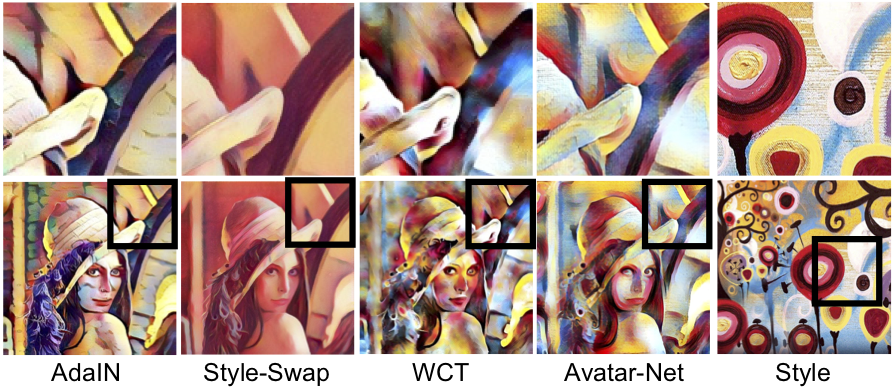

# Avatar-Net: Multi-scale Zero-shot Style Transfer by Feature Decoration

This repository contains the code (in [TensorFlow](https://www.tensorflow.org/)) for the paper:

[__Avatar-Net: Multi-scale Zero-shot Style Transfer by Feature Decoration__](https://arxiv.org/abs/1805.03857)
<br>
[Lu Sheng](http://www.ee.cuhk.edu.hk/~lsheng/), [Ziyi Lin](mailto:linziyi@sensetime.com), [Jing Shao](http://www.ee.cuhk.edu.hk/~jshao/), [Xiaogang Wang](http://www.ee.cuhk.edu.hk/~xgwang/)
<br>
CVPR 2018

## Overview

In this repository, we propose an efficient and effective Avatar-Net that enables visually plausible multi-scale transfer for _arbitrary_ style in real-time. The key ingredient is a __style decorator__ that makes up the content features by semantically aligned style features, which does not only holistically match their feature distributions but also preserve detailed style patterns in the decorated features. By embedding this module into an image reconstruction network that fuses multi-scale style abstractions, the Avatar-Net renders multi-scale stylization for any style image in one feed-forward pass.

[teaser]: ./docs/figures/teaser.png
![teaser]

## Examples
[image_results]: ./docs/figures/image_results.png
![image_results]

## Comparison with Prior Arts

<p align='center'></p>

- The result by Avatar-Net receives concrete multi-scale style patterns (e.g. color distribution, brush strokes and circular patterns in _candy_ image).
- [WCT](https://arxiv.org/abs/1705.08086) distorts the brush strokes and circular patterns. [AdaIN](https://arxiv.org/abs/1703.06868) cannot even keep the color distribution, while [Style-Swap](https://arxiv.org/abs/1612.04337) fails in this example.

#### Execution Efficiency
|Method| Gatys et. al. | AdaIN | WCT | Style-Swap | __Avatar-Net__ |
| :---:  | :---:       | :---: | :---: | :---:    | :---:         |
| __256x256 (sec)__ | 12.18 | 0.053 | 0.62 | 0.064 | __0.071__ |
| __512x512 (sec)__ | 43.25 | 0.11 | 0.93 | 0.23 | __0.28__ |

- Avatar-Net has a comparable executive time as AdaIN and GPU-accelerated Style-Swap, and is much faster than WCT and the optimization-based style transfer by [Gatys _et. al._](https://arxiv.org/abs/1508.06576).
- The reference methods and the proposed Avatar-Net are implemented on a same TensorFlow platform with a same VGG network as the backbone.

## Dependencies
- [TensorFlow](https://www.tensorflow.org/) (version >= 1.0, but just tested on TensorFlow 1.0).
- Heavily depend on [TF-Slim](https://github.com/tensorflow/tensorflow/tree/master/tensorflow/contrib/slim) and its [model repository](https://github.com/tensorflow/models/tree/master/research/slim).

## Download
- The trained model of Avatar-Net can be downloaded through the [Google Drive](https://drive.google.com/open?id=1_7x93xwZMhCL-kLrz4B2iZ01Y8Q7SlTX).
- The training of our style transfer network requires pretrained [VGG](https://arxiv.org/abs/1409.1556) networks, and they can be obtained from the [TF-Slim model repository](ttps://github.com/tensorflow/models/tree/master/research/slim). The encoding layers of Avatar-Net are also borrowed from pretrained VGG models.
- [MSCOCO](http://cocodataset.org/#home) dataset is applied for the training of the proposed image reconstruction network.

## Usage

### Basic Usage

Simply use the bash file  `./scripts/evaluate_style_transfer.sh` to apply Avatar-Net to all content images in `CONTENT_DIR` from any style image in `STYLE_DIR`. For example,

    bash ./scripts/evaluate_style_transfer.sh gpu_id CONTENT_DIR STYLE_DIR EVAL_DIR 

- `gpu_id`: the mounted GPU ID for the TensorFlow session.
- `CONTENT_DIR`: the directory of the content images. It can be `./data/contents/images` for multiple exemplar content images, or `./data/contents/sequences` for an exemplar content video.
- `STYLE_DIR`: the directory of the style images. It can be `./data/styles` for multiple exemplar style images.
- `EVAL_DIR`: the output directory. It contains multiple subdirectories named after the names of the style images.

More detailed evaluation options can be found in `evaluate_style_transfer.py`, such as

    python evaluate_style_transfer.py

### Configuration

The detailed configuration of Avatar-Net is listed in `configs/AvatarNet.yml`, including the training specifications and network hyper-parameters. The style decorator has three options:

- `patch_size`: the patch size for the normalized cross-correlation, in default is `5`.
- `style_coding`: the projection and reconstruction method, either `ZCA` or `AdaIN`.
- `style_interp`: interpolation option between the transferred features and the content features, either `normalized` or `biased`.

The style transfer is actually performed in `AvatarNet.transfer_styles(self, inputs, styles, inter_weight, intra_weights)`, in which

- `inputs`: the content images.
- `styles`: a list of style images (`len(styles)` > 2 for multiple style interpolation).
- `inter_weight`: the weight balancing the style and content images.
- `intra_weights`: a list of weights balancing the effects from different styles.

Users may modify the evaluation script for multiple style interpolation or content-style trade-off.

### Training

1. Download [MSCOCO](http://cocodataset.org/#home) datasets and transfer the raw images into `tfexamples`, according to the python script `./datasets/convert_mscoco_to_tfexamples.py`.
2. Use `bash ./scripts/train_image_reconstruction.sh gpu_id DATASET_DIR MODEL_DIR` to start training with default hyper-parameters. `gpu_id` is the mounted GPU for the applied Tensorflow session. Replace `DATASET_DIR` with the path to MSCOCO training images and `MODEL_DIR` to Avatar-Net model directory.

## Citation

If you find this code useful for your research, please cite the paper:

Lu Sheng, Ziyi Lin, Jing Shao and Xiaogang Wang, "Avatar-Net: Multi-scale Zero-shot Style Transfer by Feature Decoration", in IEEE Conference on Computer Vision and Pattern Recognition (CVPR), 2018. [[Arxiv](https://arxiv.org/abs/1805.03857)]

```
@inproceedings{sheng2018avatar,
    Title = {Avatar-Net: Multi-scale Zero-shot Style Transfer by Feature Decoration},
    author = {Sheng, Lu and Lin, Ziyi and Shao, Jing and Wang, Xiaogang},
    Booktitle = {Computer Vision and Pattern Recognition (CVPR), 2018 IEEE Conference on},
    pages={1--9},
    year={2018}
}
```

## Acknowledgement

This project is inspired by many style-agnostic style transfer methods, including [AdaIN](https://arxiv.org/abs/1703.06868), [WCT](https://arxiv.org/abs/1705.08086) and [Style-Swap](https://arxiv.org/abs/1612.04337), both from their papers and codes.

## Contact

If you have any questions or suggestions about this paper, feel free to contact me ([lsheng@ee.cuhk.edu.hk](mailto:lsheng@ee.cuhk.edu.hk))
